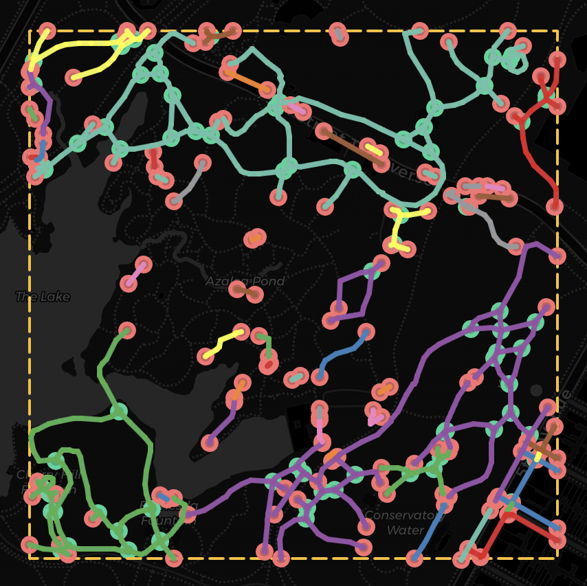
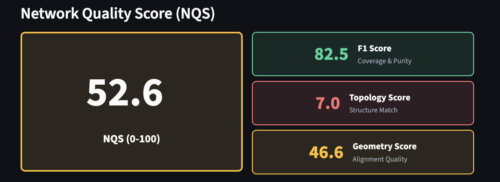
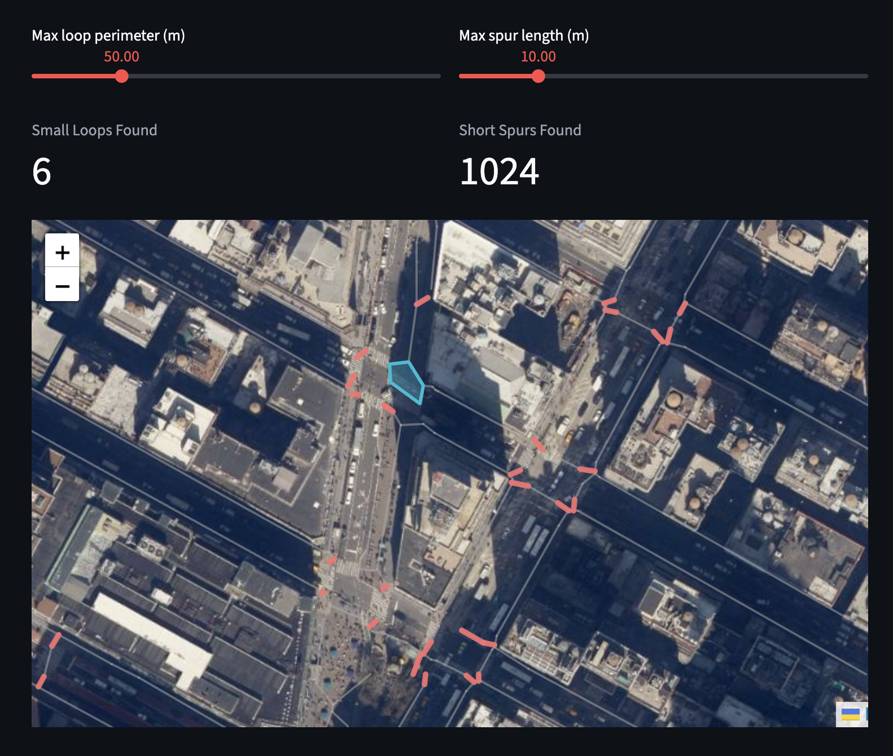
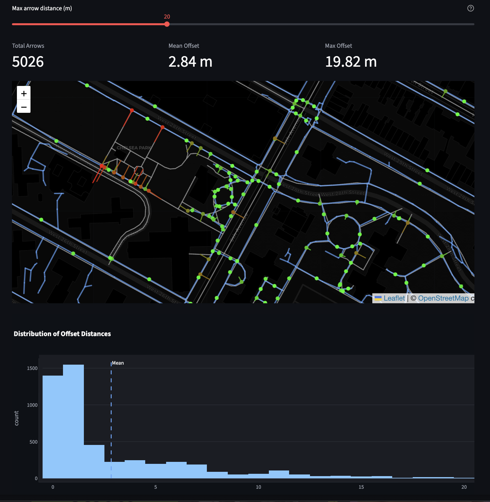
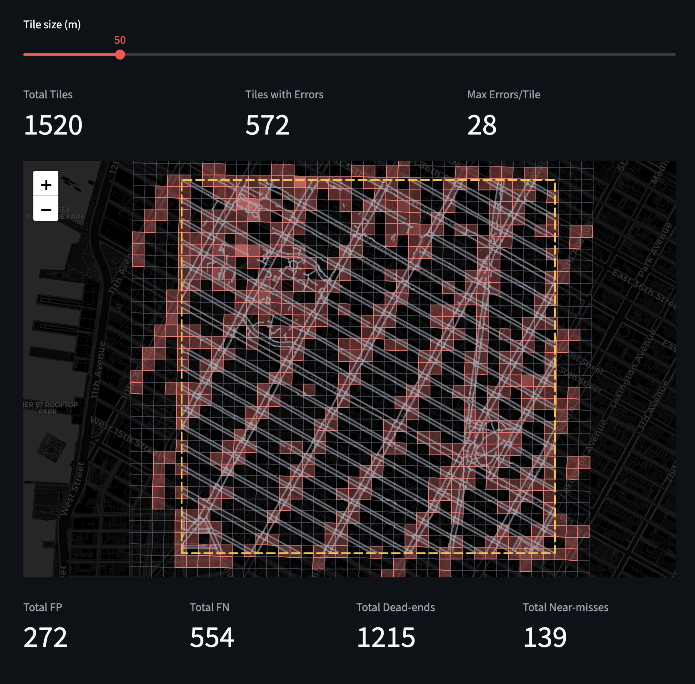

# Pedestrian Network Quality Inspector



A visualization tool for assessing the **topological and geometric quality** of AI-generated pedestrian networks from [tile2net](https://github.com/VIDA-NYU/tile2net).

## Features

The application provides seven interactive views for comprehensive network analysis:

### Overview Dashboard
- **Network Quality Score (NQS)** - A single 0-100 score combining F1, topology, and geometry subscores
- **Key statistics** - Total edges, nodes, length, connected components, dead ends, intersections
- **Issues summary** - Automatic detection of coverage gaps, false positives, component mismatches, and alignment problems
- **Score breakdown** - Detailed explanation of how each subscore is computed

### Graph Metrics
- **Node degree distribution** - Histogram showing dead-ends (degree 1), normal nodes (degree 2), and intersections (degree 3+)
- **Connectivity indices** - Alpha (circuitry), Beta (complexity), and Gamma (connectivity ratio)
- **Betweenness centrality** - Distribution and ranking of most critical network nodes
- **Average clustering coefficient** - Measure of triangle formation in the network

### Network Map
- **Interactive Folium map** - Pan, zoom, and click to inspect network elements
- **Component coloring** - Each connected component displayed in a distinct color
- **Node degree visualization** - Option to size nodes proportionally to their degree
- **Component filtering** - Filter out large components to focus on small isolated subgraphs
- **Layer controls** - Toggle visibility of edges, nodes, dead-ends, and intersections

### Gap Diagnostics
- **Dead-end detection** - Find and visualize all degree-1 nodes
- **Near-miss endpoints** - Detect pairs of dead-ends that are close but not connected (potential gaps)
- **Missing link visualization** - Show dashed lines between near-miss pairs
- **Gap statistics** - Count and distance distribution of potential connection points

### Geometry Checks
- **Short edge detection** - Identify abnormally short segments that may indicate noise
- **Long edge detection** - Find unusually long edges based on percentile thresholds
- **Small loops** - Detect tiny cycles that may be artifacts
- **Short spurs** - Find short dead-end branches

### Edge Analysis
- **Edge length distribution** - Histogram of segment lengths in meters
- **Length categorization** - Color-coded map showing very short, normal, and very long edges
- **Percentile statistics** - Min, max, mean, median, and percentile breakdowns

### OSM Comparison
Compare the AI-generated network against OpenStreetMap ground truth:

- **Comparison Map**
  - True positives (blue/green) - Edges that match between networks
  - False positives (red) - Tile2Net edges not in OSM
  - False negatives (orange) - OSM edges missed by Tile2Net
  - Precision, recall, and F1 score metrics

- **Offset Arrows**
  - Arrows from OSM segment centroids to nearest Tile2Net edge
  - Color-coded by distance (green = good alignment, red = poor)
  - Reveals systematic spatial bias and geometric misalignment
  - Histogram of offset distances

- **Error Heat Map**
  - Divide region into configurable grid tiles
  - Count false positives, false negatives, dead-ends, and near-misses per tile
  - Color intensity indicates error density
  - Quickly identify problem areas

- **Error Gallery**
  - Rank tiles by total error count
  - Drill down into the worst tiles for focused inspection
  - Mini-maps showing detailed view of each problem area

## Installation

```bash
# Clone or navigate to the project
cd pedestrian-network-inspector

# Create virtual environment (recommended)
python -m venv venv
source venv/bin/activate  # On Windows: venv\Scripts\activate

# Install dependencies
pip install -r requirements.txt
```

## Usage

### Run the Application

```bash
streamlit run app.py
```

The application will open in your browser at `http://localhost:8501`.

### Input Data

**Upload a ZIP file** - Upload the output ZIP from tile2net containing network shapefiles.
The Central Park (small and faster to run) and Chelsea (larger and slower to run) sample data zips are included.

### Expected ZIP Structure

```
your_output.zip
├── network/
│   └── *-Network-*/
│       ├── *.shp
│       ├── *.shx
│       ├── *.dbf
│       ├── *.prj
│       └── *.cpg
├── polygons/
│   └── *-Polygons-*/
│       └── ...
├── tiles/
│   ├── *_info.json
│   └── ...
└── structure.json
```

## Quality Metrics Explained

### Network Quality Score (NQS) - 0 to 100

The NQS is a weighted combination of three subscores:

| Component | Weight | Description |
|-----------|--------|-------------|
| **F1 Score** | 50% | Length-weighted precision and recall against OSM |
| **Topology Score** | 30% | Similarity in connected components (beta0) and cycles (beta1) |
| **Geometry Score** | 20% | Exponential decay based on median alignment distance |

**Interpretation:**
- 90-100: Excellent - Very close to ground truth in edges, structure, and geometry
- 80-89: Very Good - Likely usable with small local issues
- 60-79: Usable - Noticeable gaps, false positives, or structural differences
- Below 60: Needs Work - Significant missing or spurious structure

### Connectivity Indices

| Index | Formula | Interpretation |
|-------|---------|----------------|
| **Alpha** | (e - n + 1) / (2n - 5) | Circuit completeness (0-1) |
| **Beta** | e / n | Network complexity |
| **Gamma** | e / 3(n - 2) | Connectivity ratio (0-1) |

Where `e` = edges, `n` = nodes.

### Sinuosity
Ratio of actual path length to straight-line distance:
- **1.0** = Perfectly straight
- **>1.5** = Flagged as anomaly

## Selected Screenshots

### Quality Overview Dashboard


### Components Map


### Spurs and Loops


### Offset Arrows


### Error Heatmap


## API Usage

You can also use the analysis modules programmatically:

```python
from network_analyzer import NetworkAnalyzer, load_network_from_shapefile
from osm_comparison import OSMComparator, compute_network_quality_score

# Load network
network_gdf = load_network_from_shapefile("path/to/network.shp")

# Analyze
analyzer = NetworkAnalyzer(network_gdf)
quality_scores = analyzer.get_quality_score()
dead_ends = analyzer.get_dead_ends()
connectivity = analyzer.compute_connectivity_metrics()

# Compare with OSM
bounds = (40.773, 40.780, -73.973, -73.965)  # south, north, west, east
comparator = OSMComparator(bounds)
comparison = comparator.calculate_coverage_metrics(network_gdf)

# Compute Network Quality Score (NQS)
osm_network = comparator.fetch_osm_network()
nqs_results = compute_network_quality_score(
    gt_network=osm_network,
    pred_network=network_gdf,
    distance_tolerance=4.0,  # meters
    overlap_threshold=0.5
)
print(f"NQS: {nqs_results['NQS']:.1f}")
print(f"Interpretation: {nqs_results['interpretation']}")
```

## Key Questions Addressed

1. **Where are breaks or disconnected components?**
   - Connected components analysis with visual highlighting
   - Isolated subgraph detection

2. **Are intersections generated correctly?**
   - Intersection node identification (degree >= 3)
   - Node degree distribution analysis

3. **Can we flag geometric anomalies automatically?**
   - Sinuosity analysis
   - Edge length outlier detection
   - Automatic flagging with thresholds

4. **How does the network compare to baselines?**
   - OSM comparison with precision/recall
   - Visual diff view with layer controls
   - Network Quality Score (NQS) for quantitative assessment

## Dependencies

- **streamlit** - Web application framework
- **geopandas** - Geospatial data handling
- **networkx** - Graph analysis
- **folium** - Interactive maps
- **plotly** - Interactive charts
- **osmnx** - OpenStreetMap data (optional, for comparison)
- **scipy** - Spatial algorithms for NQS computation

## License

MIT License

## References

- [tile2net](https://github.com/VIDA-NYU/tile2net) - AI pedestrian network extraction
- [OSMnx](https://github.com/gboeing/osmnx) - OpenStreetMap network analysis
